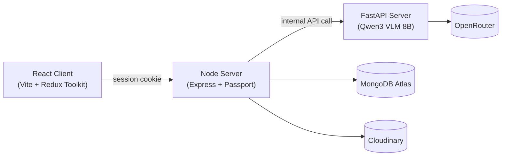

# Hotel Review Analysis

An AI-powered platform that takes a guest's hotel review — text plus optional photos — and breaks it down into individual claims (cleanliness, bathroom, food, etc.), tags each with a sentiment, and **visually grounds** claims in the submitted photos wherever possible, drawing a bounding box around the exact evidence in the image.

Built as a microservice architecture: a Node/Express server handles auth, users, and orchestration; a separate FastAPI server runs the ML pipeline using a vision-language model.

## Features

- 📝 Submit a review (text + up to 5 photos) and get back structured, aspect-level analysis
- 🖼️ Claims are cross-referenced against submitted photos — when a claim ("cracked bathroom tile") is visible in an image, the app returns a bounding box pinpointing it
- 🔐 Email/password auth and Google OAuth sign-in
- 📚 Review history with per-result detail views
- 🌗 Light/dark theme, persisted across sessions

## Architecture



| Layer              | Stack                                                                                   |
| ------------------ | --------------------------------------------------------------------------------------- |
| **Client**         | React, Vite, Redux Toolkit, React Router v6, Tailwind CSS v4                            |
| **Node Server**    | Express, Passport (local + Google OAuth), Mongoose, `express-session` + `connect-mongo` |
| **FastAPI Server** | FastAPI, httpx, Pydantic — orchestrates calls to **Qwen3 VLM 8B** via OpenRouter        |
| **Data**           | MongoDB Atlas                                                                           |
| **Media**          | Cloudinary                                                                              |
| **Hosting**        | Vercel (client), Render (Node + FastAPI)                                                |

## Repository Structure

```text
.
├── client/            # React (Vite) frontend
├── node server/        # Express API — auth, users, orchestration
├── fastApi server/     # FastAPI microservice — Qwen3 VLM analysis pipeline
├── docs/               # Detailed documentation (see below)
└── README.md
```

## Documentation

Detailed docs live in [`docs/`](./docs):

| Doc                                                        | Covers                                                                                                                                     |
| ---------------------------------------------------------- | ------------------------------------------------------------------------------------------------------------------------------------------ |
| [`docs/data-modeling.md`](./docs/data-modeling.md)         | MongoDB schemas (`User`, `Input`, `Result`), relationships, and the aspect/evidence data shape                                             |
| [`docs/api-documentation.md`](./docs/api-documentation.md) | Every HTTP endpoint on both servers — Node's public API and the internal FastAPI analysis endpoint, including the two-stage Qwen3 pipeline |
| [`docs/backend.md`](./docs/backend.md)                     | Internal architecture of both servers — auth strategies, middleware, file uploads, shared utilities, error handling                        |
| [`docs/infrastructure.md`](./docs/infrastructure.md)       | Hosting, third-party services, environment variables, and local dev setup                                                                  |
| [`docs/frontend.md`](./docs/frontend.md)                   | Client architecture — routing, state management, API layer, styling/theming                                                                |

## Getting Started

### Prerequisites

- Node.js (for `client/` and `node server/`)
- Python 3.10+ (for `fastApi server/`)
- A MongoDB Atlas cluster
- A Cloudinary account
- A Google OAuth 2.0 client (for social login)
- An OpenRouter API key (for Qwen3 VLM 8B access)

### Setup

1. Clone the repo and install dependencies:

   ```bash
   cd client && npm install
   cd ../"node server" && npm install
   cd ../"fastApi server" && pip install -r requirements.txt
   ```

2. Copy each `.env.sample` to `.env` in `client/`, `node server/`, and `fastApi server/`, and fill in your credentials. See [`docs/infrastructure.md`](./docs/infrastructure.md) for the full variable reference.

3. Run each service in its own terminal:

   ```bash
   # Client
   cd client && npm run dev

   # Node server
   cd "node server" && npm run start

   # FastAPI server
   cd "fastApi server" && fastapi dev app/main.py
   ```

4. Visit `http://localhost:5173`.

Full setup details (Google OAuth redirect URI, MongoDB IP allowlisting, etc.) are in [`docs/infrastructure.md`](./docs/infrastructure.md#local-development-setup).


## Contributing

Issues and PRs are welcome. Please check the relevant doc in [`docs/`](./docs) before making architectural changes, since several conventions (response envelopes, auth flow, the analysis pipeline) are documented in detail there.

## License

_Add your chosen license here (e.g. MIT) before publishing._
