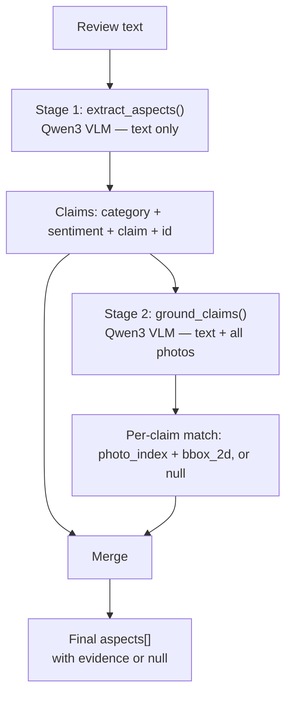

# API Documentation

This document describes the public HTTP API surface of the platform. There are **two API surfaces**:

1. **Node Server** — public-facing API consumed by the client. Handles authentication, session management, review submission orchestration, and history/result retrieval.
2. **FastAPI Server** — internal microservice, not exposed to the client directly. Called server-to-server by the Node server to run the Qwen3 VLM 8B analysis.

Unless noted otherwise, all Node routes return a consistent success envelope via `ApiResponse`:

```json
{
  "successCode": 200,
  "data": {
    /* endpoint-specific payload */
  },
  "message": "Human readable message",
  "success": true
}
```

Errors are raised via `ApiError` and are caught by a global error-handling middleware (`globalErrorHandler`), which returns:

```json
{
  "success": false,
  "status": 400,
  "message": "Human readable error message"
}
```

_(plus a `stack` field, only when `process.env.MODE === "development"`)_

`globalErrorHandler` also special-cases two Mongoose error types before falling back to `err.statusCode || 500`:

- **`CastError`** (e.g. malformed ObjectId in a route param) → `400`, message `"Invalid format for field: {field}"`
- **MongoDB duplicate key error (`code: 11000`)** → `409`, message `"This {Field} is already taken. Please choose another."` (field name auto-capitalized from the offending unique index)

> **Auth model:** Session-based auth via **Passport.js** (`passport-local` + `passport-google-oauth20`), backed by an Express session store persisted to MongoDB Atlas. The session cookie (`connect.sid`) is the credential — there is no bearer/JWT token in the current implementation. Protected routes use the `ensureAuthenticated` middleware, which checks `req.user` (populated by Passport's session deserialization).

---

## Node Server

Base path below (`/api/v1/auth`, `/api/v1/users`), api versioninig has been involved.
_(Look into app.js)_

### Auth Routes

Router: `auth.route.js` · Controller: `auth.controller.js`

| Method | Path               | Auth Required | Description                                 |
| ------ | ------------------ | ------------- | ------------------------------------------- |
| `POST` | `/register`        | No            | Register a new user with email/password     |
| `POST` | `/login`           | No            | Log in with email/password (local strategy) |
| `POST` | `/logout`          | Yes           | Log out and destroy session                 |
| `GET`  | `/google`          | No            | Initiate Google OAuth flow                  |
| `GET`  | `/google/callback` | No            | Google OAuth callback / redirect handler    |
| `GET`  | `/me`              | No\*          | Get current authenticated user              |

\* `/me` doesn't run `ensureAuthenticated` at the route level; it checks `req.user` internally and throws `401` if absent.

#### `POST /register`

Registers a new user and immediately logs them in (auto-login via `req.login`).

**Request body**

```json
{
  "email": "user@example.com",
  "password": "plaintext-password",
  "fullName": "Jane Doe"
}
```

| Field      | Type   | Required | Notes                                                       |
| ---------- | ------ | -------- | ----------------------------------------------------------- |
| `email`    | string | Yes      | Lowercased and checked for uniqueness before creation.      |
| `password` | string | Yes      | Hashed via bcrypt in the `User` model's `pre('save')` hook. |
| `fullName` | string | Yes      |                                                             |

**Responses**

| Status | Condition                                  | Body                                                                         |
| ------ | ------------------------------------------ | ---------------------------------------------------------------------------- |
| `201`  | Success                                    | `{ data: { user: SanitizedUser }, message: "User registered successfully" }` |
| `400`  | Missing `email`, `password`, or `fullName` | `ApiError`                                                                   |
| `409`  | Email already registered                   | `ApiError`                                                                   |
| `500`  | User created but session login failed      | `ApiError` ("Registered, but auto-login failed")                             |

**`SanitizedUser` shape** (used across auth responses):

```json
{
  "id": "ObjectId",
  "email": "string",
  "fullName": "string",
  "avatarUrl": "string | undefined",
  "emailVerified": "boolean"
}
```

---

#### `POST /login`

Authenticates via Passport's `local` strategy, then establishes a session.

**Request body**

```json
{
  "email": "user@example.com",
  "password": "plaintext-password"
}
```

**Responses**

| Status | Condition                                                          | Body                                                                                         |
| ------ | ------------------------------------------------------------------ | -------------------------------------------------------------------------------------------- |
| `200`  | Success                                                            | `{ data: { user: SanitizedUser }, message: "User logged in successfully" }`                  |
| `401`  | Invalid credentials                                                | `ApiError`, message from Passport's `info.message` (defaults to "Invalid email or password") |
| `500`  | Internal Passport/authentication error, or session creation failed | `ApiError`                                                                                   |

---

#### `POST /logout`

**Auth required**

1. Ends the Passport session
2. destroys the underlying session document in MongoDB
3. then clears the session cookie.

**Responses**

| Status | Condition                    | Body                                                    |
| ------ | ---------------------------- | ------------------------------------------------------- |
| `200`  | Success                      | `{ data: {}, message: "User logged out successfully" }` |
| `500`  | `req.logout` failed          | `ApiError` with underlying error message in `errors[]`  |
| `500`  | Session destroy in DB failed | `ApiError` with underlying error message in `errors[]`  |

Cookie cleared: `connect.sid` (`httpOnly: true`, `secure` in production based on `process.env.MODE`).

---

#### `GET /google`

Initiates the Google OAuth2 flow via `passport.authenticate("google", { scope: ["profile", "email"] })`. Redirects the browser to Google's consent screen. No JSON response — this is a redirect-only route.

---

#### `GET /google/callback`

Handles Google's OAuth redirect. On completion, always responds with an HTTP redirect to `CLIENT_URL`, never a JSON body — since the browser is mid-redirect from Google.

| Outcome                               | Redirect target                                    |
| ------------------------------------- | -------------------------------------------------- |
| Success                               | `${CLIENT_URL}/dashboard`                          |
| Passport/strategy error               | `${CLIENT_URL}/signin?error=GoogleAuthFailed`      |
| No user returned (unauthorized)       | `${CLIENT_URL}/signin?error=Unauthorized`          |
| Session creation (`req.login`) failed | `${CLIENT_URL}/signin?error=SessionCreationFailed` |

---

#### `GET /me`

Returns the currently authenticated user based on the active session.

**Responses**

| Status | Condition                             | Body                                                                     |
| ------ | ------------------------------------- | ------------------------------------------------------------------------ |
| `200`  | Session active                        | `{ data: { user: SanitizedUser }, message: "User fetched Successfuly" }` |
| `401`  | No active session (`req.user` absent) | `ApiError`                                                               |

---

### Review Analysis & History Routes

Router: `user.route.js` · Controller: `user.controller.js`

| Method | Path                   | Auth Required | Middleware                                              | Description                                         |
| ------ | ---------------------- | ------------- | ------------------------------------------------------- | --------------------------------------------------- |
| `POST` | `/get-review-analysis` | Yes           | `ensureAuthenticated`, `photoUploadMiddleware` (Multer) | Submit a review (+ optional photos) for AI analysis |
| `GET`  | `/me/history`          | Yes           | `ensureAuthenticated`                                   | Get the current user's last 20 submitted reviews    |
| `GET`  | `/history/:inputId`    | Yes           | `ensureAuthenticated`                                   | Get result(s) for a specific `Input`                |
| `GET`  | `/results/:resultId`   | Yes           | `ensureAuthenticated`                                   | Get a specific `Result` by ID (ownership-checked)   |

#### `POST /get-review-analysis`

The core orchestration endpoint of the platform. Uploads any attached photos to Cloudinary, forwards the review + photo URLs to the FastAPI/Qwen3 analysis service, then atomically persists both the `Input` and `Result` documents.

**Request:** `multipart/form-data`

| Field    | Type                | Required | Notes                                                                                                 |
| -------- | ------------------- | -------- | ----------------------------------------------------------------------------------------------------- |
| `review` | string (form field) | Yes      | The review text.                                                                                      |
| `photos` | file[] (form field) | No       | One or more image files, handled by `photoUploadMiddleware` and made available at `req.files.photos`. |

**Processing pipeline**

1. Validates `review` is present (`400` if missing).
2. Uploads each photo in `req.files.photos` to Cloudinary in parallel (`Promise.all`); failed uploads (`null` results) are filtered out silently.
3. Calls the FastAPI server (`process.env.FASTAPI_SERVER_URL`) with a **60-second timeout** via `AbortController`:

   ```json
   POST <FASTAPI_SERVER_URL>
   Content-Type: application/json

   { "review": "string", "photoUrls": ["string", "..."] }
   ```

4. On network failure/timeout → `503 "AI analysis microservice is currently unreachable or offline"`.
5. On non-OK response from FastAPI → propagates FastAPI's status code, using `detail` or `message` from its error body if present.
6. On success, opens a MongoDB session/transaction and atomically:
   - Creates the `Input` document (review, image URLs, `user`)
   - Creates the `Result` document (`input` ref + `aspects` from the FastAPI response)
   - Commits, or aborts and rolls back on any failure.

**Responses**

| Status             | Condition                                 | Body                                                                                            |
| ------------------ | ----------------------------------------- | ----------------------------------------------------------------------------------------------- |
| `200`              | Success                                   | `{ data: { _id, inputId, aspects: [...] }, message: "Review analysis generated successfully" }` |
| `400`              | Missing `review`                          | `ApiError`                                                                                      |
| `503`              | FastAPI service unreachable/timed out     | `ApiError`                                                                                      |
| `<FastAPI status>` | FastAPI returned a non-OK response        | `ApiError` with forwarded message                                                               |
| `500`              | DB transaction failed (Input/Result save) | `ApiError`                                                                                      |

**Success response shape**

```json
{
  "successCode": 200,
  "data": {
    "_id": "ResultObjectId",
    "inputId": "InputObjectId",
    "aspects": [
      {
        "category": "cleanliness",
        "sentiment": "positive",
        "claim": "The bathroom was spotless.",
        "evidence": {
          "photo_url": "https://...",
          "bbox_2d": [10, 20, 300, 400]
        }
      }
    ]
  },
  "message": "Review analysis generated successfully",
  "success": true
}
```

> See [data-modeling.md](./data-modeling.md) for the full `aspects`/`evidence` shape.

---

#### `GET /me/history`

Returns the authenticated user's most recent review submissions (`Input` documents), newest first.

**Query behavior:** sorted by `createdAt: -1`, limited to **20** results, returned as plain objects (`.lean()`).

**Responses**

| Status | Condition                                                                      | Body                                                                  |
| ------ | ------------------------------------------------------------------------------ | --------------------------------------------------------------------- |
| `200`  | Has history                                                                    | `{ data: [Input, ...], message: "User history fetched successfuly" }` |
| `200`  | No history                                                                     | `{ data: [], message: "No History" }`                                 |
| `404`  | No authenticated user (should not normally occur behind `ensureAuthenticated`) | `ApiError`                                                            |

Each item in `data` is a raw `Input` document (see [data-modeling.md](./data-modeling.md) `Input` schema) — `review`, `images`, `user`, `createdAt`, `updatedAt`.

---

#### `GET /results/:resultId`

Fetches a single `Result` by ID, with its parent `Input` populated, and enforces that the result belongs to the requesting user.

**Path params:** `resultId` — `Result` document `_id`.

**Responses**

| Status | Condition                                     | Body                                                                              |
| ------ | --------------------------------------------- | --------------------------------------------------------------------------------- |
| `200`  | Found and owned by requester                  | `{ data: Result (with populated input), message: "Result fetched successfully" }` |
| `400`  | Missing `resultId`                            | `ApiError`                                                                        |
| `404`  | Result not found                              | `ApiError`                                                                        |
| `404`  | Result exists but belongs to a different user | `ApiError` ("Unauthorized request")                                               |

---

#### `GET /history/:inputId`

Fetches `Result` document(s) associated with a specific `Input`, with a partial population of the input (`_id review images`).

**Path params:** `inputId` — `Input` document `_id`.

**Responses**

| Status | Condition                    | Body                                                              |
| ------ | ---------------------------- | ----------------------------------------------------------------- |
| `200`  | Success (may be empty array) | `{ data: [Result, ...], message: "Result fetched successfully" }` |
| `400`  | Missing `inputId`            | `ApiError`                                                        |
| `500`  | Query failed unexpectedly    | `ApiError`                                                        |

---

## FastAPI Server (Internal)

This is a **microservice, not exposed to the client**. It is called server-to-server, exclusively by the Node server's `getReviewAnalysis` controller (`POST <FASTAPI_SERVER_URL>` → mapped to `/api/v1/reviews/analyse` below).

> **Auth note:** The route currently has no authentication/shared-secret check of its own — it trusts that network placement (private network / internal-only ingress) restricts who can reach it. See [infrastructure.md](./infrastructure.md) for how this boundary is enforced in deployment. Recommend adding a shared-secret header (e.g. `X-Internal-Key`) validated via a FastAPI dependency if the service is ever reachable from outside a trusted network.

### Model & Provider

- **Model:** `qwen/qwen3-vl-8b-instruct` (Qwen3 VLM 8B)
- **Provider:** [OpenRouter](https://openrouter.ai) chat completions API (`https://openrouter.ai/api/v1/chat/completions`)
- **Auth to OpenRouter:** Bearer token via `OPENROUTER_API_KEY` env var
- Both pipeline stages (below) call the model with `temperature: 0.1` and `response_format: { type: "json_object" }` for structured, low-variance output.

### Router mount

```python
app.include_router(reviews.router, prefix="/api/v1/reviews", tags=["Review AI"])
```

### `POST /api/v1/reviews/analyse`

The single entry point for review analysis. Runs a **two-stage LLM pipeline**: text-only aspect extraction, followed by cross-modal (image) grounding of each extracted claim.

**Request body** (`ExtractionRequest`, Pydantic model — inferred fields based on usage):

| Field       | Type                       | Required | Notes                                                                                   |
| ----------- | -------------------------- | -------- | --------------------------------------------------------------------------------------- |
| `review`    | `str`                      | Yes      | Raw review text.                                                                        |
| `photoUrls` | `List[HttpUrl]` (or `str`) | No       | List of image URLs (Cloudinary URLs from the Node server). Coerced to `str` before use. |

**Response body** (`ApiResponse` wrapper — mirrors the Node envelope shape):

```json
{
  "statusCode": 200,
  "data": {
    "aspects": [
      {
        "category": "bathroom",
        "sentiment": "negative",
        "claim": "The bathroom tile was cracked.",
        "evidence": {
          "photo_url": "https://res.cloudinary.com/.../photo3.jpg",
          "bbox_2d": [120, 340, 560, 780]
        }
      },
      {
        "category": "other",
        "sentiment": "positive",
        "claim": "Staff were very friendly.",
        "evidence": null
      }
    ]
  },
  "message": "Aspects extracted successfully"
}
```

**Error responses**

| Status | Condition                                           | Detail                                                |
| ------ | --------------------------------------------------- | ----------------------------------------------------- |
| `502`  | Upstream model returned malformed/non-JSON content  | `"AI service returned malformed JSON: {error}"`       |
| `502`  | Upstream (OpenRouter) returned an HTTP error status | `"Upstream AI provider error: {status_code}"`         |
| `504`  | Upstream request timed out                          | `"AI service timed out while processing the review."` |
| `500`  | Any other unhandled exception                       | `"Internal server error during extraction: {error}"`  |

These map directly to the Node server's error handling in `getReviewAnalysis` (`errorData.detail` is read from this `detail` field).

---

### Internal Pipeline (`text_aspects_service`)

The `/analyse` route delegates to `analyze_multimodal_review(review_text, photo_urls)`, which runs two sequential model calls:



#### Stage 1 — `extract_aspects(review_text)`

- Sends the review text alone to Qwen3 with a prompt instructing it to extract every distinct claim (complaint or praise) as JSON.
- Each returned aspect has `category` (enum: `cleanliness | bedroom | bathroom | food_and_beverages | surrounding_area | other`), `sentiment` (`positive | negative | neutral`), and `claim` (verbatim-grounded text).
- A local **stable 8-character hex `id`** (`uuid.uuid4().hex[:8]`) is attached to each claim after the model call, used only internally to correlate Stage 1 output with Stage 2 output. This `id` is **not** part of the final API response.
- 30-second request timeout to OpenRouter.

#### Stage 2 — `ground_claims(claims, photo_urls)`

- Skips entirely (returns all-`None`) if there are no claims or no photos.
- Builds a single multimodal prompt containing:
  - The full list of claims (by `id` + text)
  - All photos, each preceded by a `"Photo N:"` text label, in order
- Instructs the model to decide, per claim, whether it is **literally visible** in any photo — explicitly discouraging inference/guessing. Abstract claims (e.g. "friendly staff") are expected to always resolve to `match: null`.
- **Bounding box convention:** `bbox_2d` is `[x1, y1, x2, y2]` on a **normalized 0–1000 scale** (not raw pixels, not 0–1 fractions) — the prompt explicitly asks the model to bound coordinates this way. This resolves the open question flagged in [data-modeling.md](./data-modeling.md); update that doc's schema notes accordingly.
- 60-second request timeout to OpenRouter (longer than Stage 1, since multiple images are attached).
- **Validation before accepting a match:** the response is only trusted if:
  - `claim_id` matches one from the original request (otherwise ignored, comment notes "model hallucinated an id we didn't ask about")
  - `match` is a dict (not `null`/missing/malformed)
  - `photo_index` is an int within `1..len(photo_urls)`
  - `bbox_2d` is a 4-element list of numbers
  - Coordinates are then clamped to `[0, 1000]` and cast to `int`
- Any claim that fails validation is left as `None` rather than falling back to a guess.

#### Merge step

`analyze_multimodal_review` merges Stage 1 claims with Stage 2 grounding results:

- If a claim has a valid match, `evidence = { photo_url: <resolved from photo_index>, bbox_2d }`.
- Otherwise, `evidence = null`.
- The internal `id` field is dropped from the final output — the response schema exactly matches the `Aspect`/`Evidence` shape in [data-modeling.md](./data-modeling.md).
