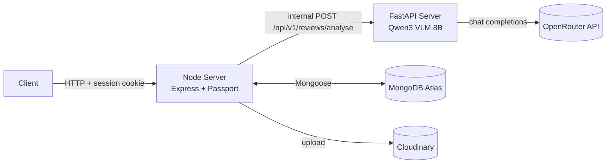

# Backend Architecture

The backend is split into **two independently-deployed services**, following a microservice boundary drawn along responsibility, not just language:

| Service            | Owns                                                                                         | Tech                        |
| ------------------ | -------------------------------------------------------------------------------------------- | --------------------------- |
| **Node server**    | Auth, users, sessions, review/history CRUD, orchestration of the analysis call, file uploads | Express, Passport, Mongoose |
| **FastAPI server** | ML inference only — the Qwen3 VLM 8B analysis pipeline                                       | FastAPI, httpx, Pydantic    |

The Node server is the only service exposed to the client. It calls the FastAPI server internally as part of handling `POST /get-review-analysis` (see [api-documentation.md](./api-documentation.md)). The FastAPI server has no knowledge of users, sessions, or the database — it's a stateless text-in/JSON-out inference service.



---

## Node Server

### Folder structure

```
node server/src/
├── config/         # Passport strategies, DB connection
├── controllers/     # auth.controller.js, user.controller.js
├── db/               # (referenced by config — Mongo connection helper)
├── middlewares/     # auth.middleware.js, multer.middleware.js
├── models/           # User, Input, Result (Mongoose schemas)
├── routes/           # auth.route.js, user.route.js
├── services/         # cloudinary.service.js
├── utils/             # ApiError, ApiResponse, asyncHandler, globalErrorHandler
├── app.js             # Express app, middleware pipeline, route mounting
├── constants.js       # e.g. DB_URL (db name used in connection string)
└── server.js          # (entry point — starts the HTTP server, not shown yet)
```

### Request/App Bootstrap (`app.js`)

Middleware is registered in this order:

1. **CORS** — `origin: process.env.CORS_ORIGIN`, `credentials: true` (required for session cookies to travel cross-origin).
2. **`app.set("trust proxy", 1)`** — trusts the first proxy hop, needed so `secure` cookies and `req.protocol` work correctly behind a reverse proxy/load balancer (relevant in production — see [infrastructure.md](./infrastructure.md)).
3. **Body parsers** — `express.json({ limit: "16kb" })`, `express.urlencoded({ extended: true, limit: "16kb" })`. Note: the 16kb limit applies to JSON/urlencoded bodies; file uploads bypass this via Multer's separate `multipart/form-data` handling.
4. **`express.static("public")`** — serves the `public/` directory (also where Multer temporarily writes uploaded files, under `public/temp`).
5. **`cookieParser()`**
6. **`express-session`**, backed by `connect-mongo` (`MongoStore`) — persists sessions in MongoDB Atlas rather than in-memory, so sessions survive server restarts and work across multiple Node instances. Cookie: `maxAge` 7 days, `httpOnly: true`, `secure: true`.
7. **`passport.initialize()`** + **`passport.session()`**
8. **Routes**: `/api/v1/auth` → `authRoute`, `/api/v1/users` → `userRoute`
9. **`globalErrorHandler`** — registered last, catches everything thrown/passed to `next(err)` upstream.

### Authentication (`config/passport.js`)

Two strategies registered on a shared `passport` singleton:

**Local strategy** (`passport-local`, fields: `email` / `password`)

- Looks up the user by lowercased email, explicitly `.select("+password")` since the field is `select: false` by default on the schema.
- If the user has no `password` set (a Google-only account), returns a friendly failure message ("This account uses Google sign-in...") rather than a generic auth failure.
- Otherwise verifies via `user.isPasswordCorrect()` (bcrypt compare, defined on the `User` model-> see [data-modeling.md](./data-modeling.md)).

**Google strategy** (`passport-google-oauth20`)

- On callback, resolves the user in priority order:
  1. Existing user with matching `google.id` → log in directly.
  2. No `google.id` match, but an existing user with the same email → **links** the Google identity to that account (`user.google = { id, email }`, sets `emailVerified: true`, saves with `validateBeforeSave: false`).
  3. No match at all → creates a brand-new `User` with `emailVerified: true` (Google-verified emails are trusted) and `avatarUrl` from the Google profile photo.

**Session persistence**

- `serializeUser` stores only `user.id` in the session.
- `deserializeUser` re-fetches the full user by ID on every request to a protected route (runs before `req.user` is available to `ensureAuthenticated`/controllers).

### File Uploads (`middlewares/multer.middleware.js`)

- Uses `multer.diskStorage`, writing temporarily to `./public/temp` with filenames of the form `{fieldname}-{timestamp}-{random}`.
- `photoUploadMiddleware` wraps a `.fields([{ name: "photos", maxCount: 5 }])` config — so a review can have **at most 5 photos**.
- Multer errors are translated into `ApiError`s before reaching the controller:
  - `LIMIT_UNEXPECTED_FILE` → `400`, friendly "maximum of 5 photos" message.
  - Any other `MulterError` → `400`, generic Multer error message.
  - Any non-Multer error → `500`.
- Successfully uploaded files land in `req.files.photos` for the controller to read (see `getReviewAnalysis` in [api-documentation.md](./api-documentation.md)), and are later uploaded to Cloudinary before the local temp file is deleted.

### Cloudinary Integration (`services/cloudinary.service.js`)

- `uploadOnCloudinary(localFilePath, retries = 3)`:
  - Uploads with `resource_type: "auto"` (handles images/other media without hardcoding a type).
  - **Retries up to 3 times** on failure, with a fixed **1-second delay** between attempts.
  - On success, deletes the local temp file (`fs.unlinkSync`) and returns Cloudinary's response object (controller reads `.secure_url` from this).
  - On exhausting all retries, cleans up the local temp file if it still exists and returns `null` — the calling controller filters out `null` results, so a failed upload is silently dropped rather than failing the whole request.
- Config is read from `CLOUDINARY_CLOUD_NAME`, `CLOUDINARY_API_KEY`, `CLOUDINARY_API_SECRETE`

### Database Connection (`config` / referenced `db`)

- `connectToMongoDB()` connects via `mongoose.connect(`${process.env.MONGO_DB_URL}/${DB*URL}`)`, where `DB_URL` (the database \_name*, despite the name) comes from `constants.js`.
- Logs the connected host on success; on failure, logs the error and calls `process.exit(1)` — the app intentionally refuses to start without a DB connection.

### Shared Utilities {#shared-utilities}

| Utility              | Purpose                                                                                                                                                                                                                                                                                                                                                               |
| -------------------- | --------------------------------------------------------------------------------------------------------------------------------------------------------------------------------------------------------------------------------------------------------------------------------------------------------------------------------------------------------------------- |
| `ApiError`           | Custom `Error` subclass: `(statusCode, message, error = [], stack = "")`. Sets `success = false`. Captures a stack trace automatically unless one is passed in.                                                                                                                                                                                                       |
| `ApiResponse`        | Success envelope: `(statusCode = 200, data, message = "success")`. Derives `success = statusCode < 400`.                                                                                                                                                                                                                                                              |
| `asyncHandler`       | Wraps an async Express handler so any rejected promise is forwarded to `next(error)` automatically, avoiding `try/catch` boilerplate in every controller.                                                                                                                                                                                                             |
| `globalErrorHandler` | Final Express error middleware. Defaults to `err.statusCode \|\| 500` and `err.message`. Special-cases Mongoose `CastError` (→ `400`) and MongoDB duplicate-key errors (`code: 11000`, → `409`, with a formatted "X is already taken" message derived from `err.keyValue`). Response shape: `{ success: false, statusCode, message, error, ...(stack in dev mode) }`. |

---

## FastAPI Server

### Folder structure

```
fastApi server/app/
├── api/
│   └── v1/
│       └── reviews.py       # POST /analyse route
├── schemas/                  # Pydantic models: ExtractionRequest, ApiResponse
├── services/
│   └── text_aspects_service.py   # extract_aspects, ground_claims, analyze_multimodal_review
├── utils/                     # (also exposes an ApiResponse — see note below)
└── main.py                    # FastAPI app instance, lifespan, router mounting
```

### App Bootstrap (`main.py`)

```python
@asynccontextmanager
async def lifespan(app: FastAPI):
    print("API is starting up...")
    yield
    print("Shutting down API...")

app = FastAPI(lifespan=lifespan)
app.include_router(reviews.router, prefix="/api/v1/reviews", tags=["Review AI"])
```

- Single router mounted at `/api/v1/reviews`.

### Schemas (`app/schemas`)

Two Pydantic models:

```python
class ExtractionRequest(BaseModel):
    review: str
    photoUrls: list[HttpUrl] = []

class ApiResponse(BaseModel):
    statusCode: int = 200
    data: dict = {}
    message: str = "success"
    success: bool = True
```

- `ExtractionRequest` — the FastAPI route's request body model. `photoUrls` is validated as a list of proper URLs (`HttpUrl`) via Pydantic, defaulting to an empty list if omitted.
- `ApiResponse` (schemas) — a **Pydantic** response model, used as the route's `response_model=ApiResponse` in `reviews.py`.

### Routing (`app/api/v1/reviews.py`)

Already fully documented in [api-documentation.md](./api-documentation.md#post-apiv1reviewsanalyse) — endpoint contract, request/response shapes, and error mapping. Summary of the route's responsibilities:

- Delegates the actual work to `text_aspects_service.analyze_multimodal_review`.
- Wraps the call in exception handling that maps specific `httpx`/`json` failures to appropriate HTTP status codes (`502`, `504`, `500`) with a `detail` message — the same `detail` field the Node server reads from when forwarding FastAPI errors.

### Services (`app/services/text_aspects_service.py`)

The two-stage Qwen3 pipeline (`extract_aspects` → `ground_claims` → merge) is documented in full in [api-documentation.md](./api-documentation.md#internal-pipeline-text_aspects_service), including the OpenRouter integration, prompt design, and the `bbox_2d` 0–1000 normalization/clamping logic. Not duplicated here to avoid drift between the two docs.

### Error Handling

- Route-level `try/except` in `reviews.py` catches `json.JSONDecodeError`, `httpx.TimeoutException`, and `httpx.HTTPStatusError` specifically, falling back to a generic `Exception` handler — each raising a FastAPI `HTTPException` with an appropriate status code and a `detail` string.

---
