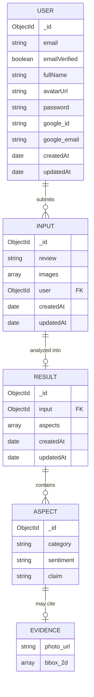
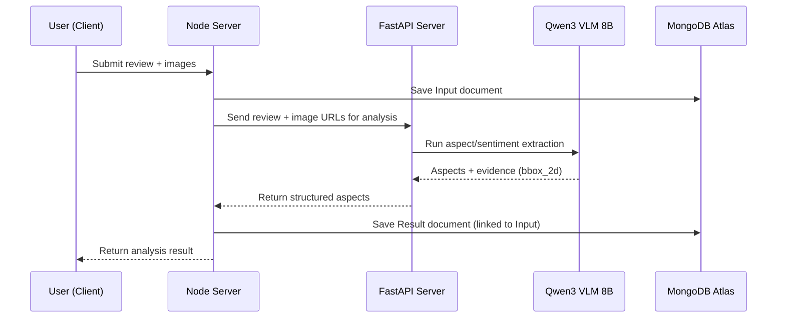

# Data Modeling

This document describes the MongoDB data model used by the hotel review analysis platform. All collections are managed via **Mongoose** on the **Node server**, which owns the database connection to **MongoDB Atlas**. The **FastAPI server** does not talk to MongoDB directly — it receives data over internal API calls and returns analysis results, which the Node server persists.

## Database

- **Provider:** MongoDB Atlas
- **ODM:** Mongoose
- **Owner service:** `node server` (see [backend.md](./backend.md) for the service split)

## Entity Overview

| Collection | Purpose                                                                                |
| ---------- | -------------------------------------------------------------------------------------- |
| `User`     | Registered users, supports email/password and Google OAuth                             |
| `Input`    | A single review submission from a user (text + optional images)                        |
| `Result`   | The analysis output produced by the ML model (FastAPI + Qwen3 VLM) for a given `Input` |

## Entity Relationship Diagram

---

## 1. `User`

Represents an authenticated user of the platform. Supports both traditional email/password auth and Google OAuth, so most Google-related fields are optional.

### Schema

| Field                     | Type      | Required | Notes                                                                                                                                                                                             |
| ------------------------- | --------- | -------- | ------------------------------------------------------------------------------------------------------------------------------------------------------------------------------------------------- |
| `email`                   | `String`  | Yes      | Trimmed, lowercased, unique. Primary identifier for login.                                                                                                                                        |
| `emailVerified`           | `Boolean` | No       | Defaults to `false`. Set to `true` once verification flow completes.                                                                                                                              |
| `fullName`                | `String`  | Yes      | Display name.                                                                                                                                                                                     |
| `avatarUrl`               | `String`  | No       | Profile picture URL (e.g. uploaded or from Google).                                                                                                                                               |
| `password`                | `String`  | No\*     | `select: false` — never returned by default in queries. Hashed via `bcrypt` (12 salt rounds) in a `pre('save')` hook. Not required at schema level because Google-only accounts have no password. |
| `google.id`               | `String`  | No       | Google account ID. Unique + sparse (allows many docs with no `google.id`).                                                                                                                        |
| `google.email`            | `String`  | No       | Email associated with the Google account (may differ from primary `email`).                                                                                                                       |
| `createdAt` / `updatedAt` | `Date`    | Auto     | From `{ timestamps: true }`.                                                                                                                                                                      |

### Behavior

- **Password hashing:** A `pre('save')` middleware hashes `password` with `bcrypt` only when the field has been modified (`isModified('password')`), preventing re-hashing on unrelated updates.
- **Password verification:** `isPasswordCorrect(password)` instance method compares a plaintext password against the stored hash using `bcrypt.compare`.
- **Auth strategies:** A user document can represent:
  - An email/password account (`password` set, `google` empty)
  - A Google OAuth account (`google.id` set, `password` may be unset)
  - Both, if the user links Google to an existing email/password account (implementation-dependent — document this once the linking flow is finalized)

### Indexes

- `email` — unique
- `google.id` — unique, sparse

---

## 2. `Input`

Represents a single review submission by a user — the raw material that gets sent to the FastAPI/Qwen3 pipeline for analysis.

### Schema

| Field                     | Type                     | Required | Notes                                                                           |
| ------------------------- | ------------------------ | -------- | ------------------------------------------------------------------------------- |
| `review`                  | `String`                 | Yes      | Free-text review content submitted by the user.                                 |
| `images`                  | `[{ imageUrl: String }]` | No       | Zero or more supporting images (e.g. hotel room photos) attached to the review. |
| `user`                    | `ObjectId` (ref: `User`) | Yes      | The submitting user.                                                            |
| `createdAt` / `updatedAt` | `Date`                   | Auto     | From `{ timestamps: true }`.                                                    |

### Relationships

- **`User` → `Input`**: one-to-many. A user can submit many `Input` documents (reviews).
- **`Input` → `Result`**: one-to-one (in current usage) — each `Input` is processed once into a corresponding `Result` document.

### Notes

- Images are stored as URLs only (pointing to wherever media is hosted — see [infrastructure.md](./infrastructure.md) for the storage provider), not binary data.
- This is the document sent (review text + image URLs) to the FastAPI service as the analysis request payload.

---

## 3. `Result`

Represents the structured output of the ML analysis pipeline (FastAPI server calling the Qwen3 VLM 8B model) for a given `Input`.

### Schema

| Field                     | Type                      | Required | Notes                                                                                                             |
| ------------------------- | ------------------------- | -------- | ----------------------------------------------------------------------------------------------------------------- |
| `input`                   | `ObjectId` (ref: `Input`) | No\*     | Links back to the source review. Not marked `required` at the schema level, but should always be set in practice. |
| `aspects`                 | `[Aspect]`                | No       | Array of extracted aspects (see below). Defaults to empty array if omitted.                                       |
| `createdAt` / `updatedAt` | `Date`                    | Auto     | From `{ timestamps: true }`.                                                                                      |

#### `Aspect` (subdocument)

Each aspect represents one discrete claim the model extracted from the review (e.g. "clean bathroom", "noisy AC"), with a sentiment and optional supporting visual evidence.

| Field       | Type       | Required | Notes                                                                                                             |
| ----------- | ---------- | -------- | ----------------------------------------------------------------------------------------------------------------- |
| `category`  | `String`   | Yes      | The aspect category (e.g. `cleanliness`, `noise`, `service`, `location`). Free-form string in the current schema. |
| `sentiment` | `String`   | Yes      | Sentiment label for this aspect (e.g. `positive`, `negative`, `neutral`). Free-form string in the current schema. |
| `claim`     | `String`   | Yes      | The specific textual claim extracted from the review supporting this aspect/sentiment pair.                       |
| `evidence`  | `Evidence` | No       | Defaults to `null`. Present only when the model grounds the claim in an attached image.                           |

Each `Aspect` subdocument keeps its own `_id` (`_id: true`), so individual aspects can be referenced/updated directly (e.g. for a moderation or feedback UI).

#### `Evidence` (subdocument, no `_id`)

| Field       | Type       | Required | Notes                                                                                         |
| ----------- | ---------- | -------- | --------------------------------------------------------------------------------------------- |
| `photo_url` | `String`   | Yes      | URL of the image the evidence was drawn from.                                                 |
| `bbox_2d`   | `[Number]` | Yes      | Bounding box coordinates. Custom validator enforces **exactly 4 values**: `[x1, y1, x2, y2]`. |

### Relationships

- **`Result` → `Input`**: many-to-one via `input` (in practice one-to-one, one `Result` per `Input`).
- **`Result` → `Aspect[]`**: one-to-many, embedded (not a separate collection).
- **`Aspect` → `Evidence`**: one-to-one (optional), embedded.

### Notes

- This schema is shaped directly around the output of the Qwen3 VLM 8B model: the model performs aspect-based sentiment extraction over the review text and, where applicable, grounds a claim to a bounding box in one of the submitted images.
- **`bbox_2d` coordinate scale:** `[x1, y1, x2, y2]` is on a **normalized 0–1000 scale**, not raw pixels — this is the scale the FastAPI grounding stage explicitly instructs Qwen3 to output, and values are clamped to `[0, 1000]` before being persisted. See [api-documentation.md](./api-documentation.md) for the full grounding pipeline. Any code rendering these boxes over an actual image must scale by the image's real dimensions: `pixel_x = bbox_x * imageWidth / 1000`.

---

## Cross-Collection Data Flow

## Future Considerations

- Consider adding an index on `Input.user` for efficient "my reviews" queries, and on `Result.input` for result lookups by review.
