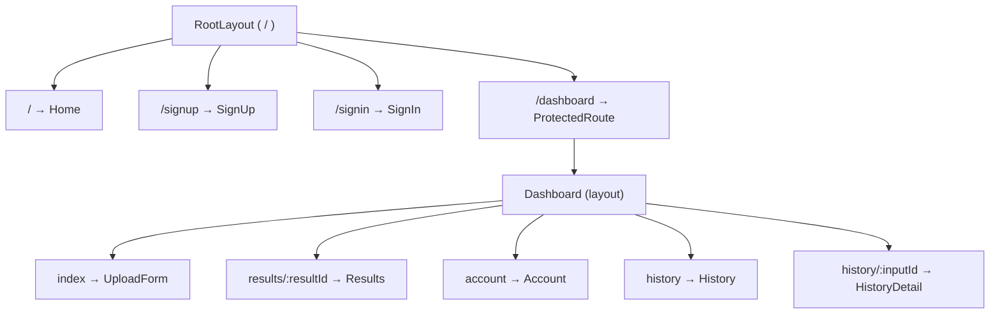

# Frontend

The client is a **React (Vite) single-page app** using **Redux Toolkit** for global state, **React Router v6's data router API** for routing, and **Tailwind CSS v4** (CSS-first config) for styling. It talks to the Node server exclusively (never directly to the FastAPI service) via a shared Axios instance, using session-cookie auth (`withCredentials: true`).

## Folder Structure

```
client/src/
├── api/
│   └── (apiClient.js — shared Axios instance)
├── assets/
├── components/
│   ├── Button.jsx
│   ├── ErrorMessage.jsx
│   ├── Input.jsx
│   └── LodingState.jsx        # (sic — likely meant "LoadingState")
├── pages/
│   ├── Dashboard/
│   │   ├── Account.jsx
│   │   ├── History.jsx
│   │   ├── HistoryDetail.jsx
│   │   ├── Results.jsx
│   │   └── UploadForm.jsx
│   ├── ProtectedRoute/
│   │   └── ProtectedRoute.jsx
│   ├── Dashboard.jsx
│   ├── Home.jsx
│   ├── RootLayout.jsx
│   ├── SignIn.jsx
│   └── SignUp.jsx
├── routes/
│   └── app.route.jsx
├── slices/
│   ├── activeResultSlice.js
│   ├── authSlice.js
│   └── themeSlice.js
├── stores/
│   └── store.js
├── App.jsx
├── Hero.png
├── index.css
└── main.jsx
```

---

## API Layer (`src/api`)

```javascript
export const apiClient = axios.create({
  baseURL: "http://localhost:3000/api/v1",
  timeout: 60000,
  withCredentials: true,
});
```

- **`withCredentials: true`** is required here — the backend uses session-cookie auth (Passport + `express-session`), not bearer tokens, so every request must carry the `connect.sid` cookie cross-requests (see [backend.md](./backend.md#authentication-configpassportjs)).
- **`timeout: 60000`** (60s) mirrors the Node server's own 60s budget for the `/get-review-analysis` call to FastAPI (see [backend.md](./backend.md#timeout-budget)). This means the client will time out around the same moment the Node server would.

---

## Routing (`src/routes/app.route.jsx`)

Built with React Router's **data router API** (`createBrowserRouter` + `createRoutesFromElements`)



| Route                          | Component       | Auth      | Corresponding API (Node)               |
| ------------------------------ | --------------- | --------- | -------------------------------------- |
| `/`                            | `Home`          | Public    | —                                      |
| `/signup`                      | `SignUp`        | Public    | `POST /auth/register`                  |
| `/signin`                      | `SignIn`        | Public    | `POST /auth/login`, `GET /auth/google` |
| `/dashboard` (index)           | `UploadForm`    | Protected | `POST /users/get-review-analysis`      |
| `/dashboard/results/:resultId` | `Results`       | Protected | `GET /users/results/:resultId`         |
| `/dashboard/account`           | `Account`       | Protected | `GET /auth/me`                         |
| `/dashboard/history`           | `History`       | Protected | `GET /users/me/history`                |
| `/dashboard/history/:inputId`  | `HistoryDetail` | Protected | `GET /users/history/:inputId`          |

- **`RootLayout`** wraps every route — likely holds shared chrome (nav bar, theme toggle) and possibly an app-boot auth check (see `authSlice.isInitializing` below).
- **`ProtectedRoute`** wraps the entire `/dashboard` subtree as a layout route (not per-page), so auth is checked once at the `/dashboard` boundary rather than duplicated per nested route.
- **`Dashboard`** itself is also a layout route (renders an `<Outlet />` for its children) — likely the dashboard's persistent sidebar/nav wrapping `UploadForm`/`Results`/`Account`/`History`/`HistoryDetail`.
- Route-to-endpoint mapping above is inferred from naming and matches the Node API surface documented in [api-documentation.md](./api-documentation.md).

---

## State Management (Redux Toolkit)

Three slices combined in `stores/store.js`:

### `authSlice`

```javascript
initialState: { user: null, isAuthenticated: false, isInitializing: true }
```

- `isInitializing: true` by default strongly suggests an app-boot flow: on load, the app calls `GET /auth/me` to check for an existing session, and only after that resolves (success → `setCredentials`, failure → `logoutUser`) does `isInitializing` flip to `false`. This is the standard pattern to avoid a flash of "logged out" UI (or an incorrect redirect from `ProtectedRoute`) while the session check is in flight wired generally in top level route.
- `logoutUser` action clears local auth state; dispatched after a successful `POST /auth/logout` call.

### `activeResultSlice`

```javascript
initialState: {
  results: null;
}
```

- Holds a single "active" analysis result. Set by `UploadForm` immediately after a successful `POST /get-review-analysis` response, so `Results` (navigated to right after submission) can render immediately without an extra fetch — falling back to fetching via `GET /users/results/:resultId` only when a result is opened from `History` instead (i.e., when landing on `/dashboard/results/:resultId` directly without this state populated).

### `themeSlice`

```javascript
initialState: {
  theme: getInitialTheme();
} // reads localStorage "theme", defaults to "light"
```

- `toggleTheme` flips between `"light"`/`"dark"` and persists to `localStorage` under the `"theme"` key.
- This Redux state needs to be synced to a `.dark` class on `<html>` for the Tailwind theme variables (see [Styling](#styling-srcindexcss) below) to actually take effect.

---

## App Bootstrap (`main.jsx` / `App.jsx`)

```javascript
// main.jsx
createRoot(document.getElementById("root")).render(
  <Provider store={store}>
    <App />
  </Provider>,
);

// App.jsx
const App = () => <RouterProvider router={router} />;
```

---

## Components (`src/components`)

For shared purposes:
`Button.jsx`, `ErrorMessage.jsx`, `Input.jsx` , `LodingState.jsx`

---

## Styling (`src/index.css`)

Uses **Tailwind CSS v4's CSS-first configuration**

### Theming approach

- **CSS custom properties** define a light theme by default on `:root`, with a `.dark` class override block providing dark-mode values for the same variable names (`--bg-app`, `--bg-surface`, `--bg-elevated`, `--border-subtle`, `--text-main`, `--text-muted`, `--text-inverse`).
- The `.dark` class is to be toggled on a root element ( `<html>`) in sync with `themeSlice.theme` and aslo localStorage syncing via store reducers.
- `@theme` then maps these CSS variables into Tailwind utility tokens (`--color-app`, `--color-surface`, etc.), so the app can use classes like `bg-app`, `text-text-main`, etc., which automatically respond to the `.dark` class without needing `dark:` variants everywhere.

### Design tokens

| Category                                 | Tokens                                                                                              |
| ---------------------------------------- | --------------------------------------------------------------------------------------------------- |
| Surfaces                                 | `app`, `surface`, `elevated`, `border-subtle`                                                       |
| Text                                     | `text-main`, `text-muted`, `text-inverse`                                                           |
| Brand — primary ("Hospitality Sapphire") | `primary-light` `#818cf8`, `primary` `#4f46e5`, `primary-dark` `#3730a3`                            |
| Brand — secondary ("Executive Gold")     | `secondary-light` `#fde047`, `secondary` `#eab308`, `secondary-dark` `#a16207`                      |
| Semantic                                 | `success` `#28a745` / `success-dark` `#218838`, `error` `#dc3545` / `error-dark` `#c82333`          |
| Static (never theme-flipped)             | `static-white`, `static-black`, `static-muted`                                                      |
| Text sizes                               | `tiny` (12px) → `base` (16px) → `medium` (18px) → `large` (20px) → `heading` (36px) → `hero` (60px) |
| Font weights                             | `regular` (400), `medium` (500), `bold` (700), `black` (900)                                        |

This gives the app a consistent, named design-token vocabulary (e.g. `text-hero`, `bg-elevated`, `text-color-error`) instead of raw Tailwind scale values, which should keep styling consistent across `Dashboard`, auth pages, and shared components as they're built out.

---
