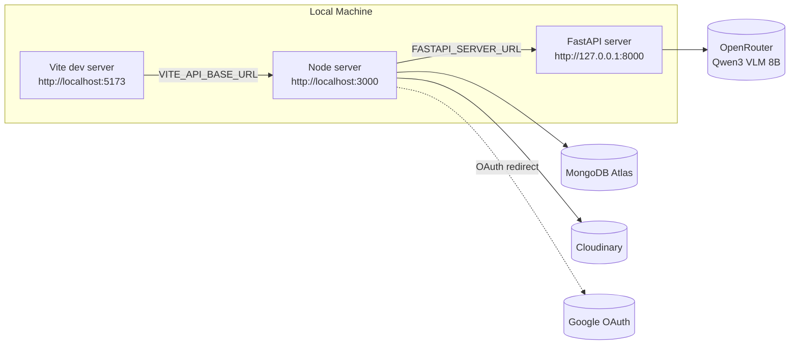

# Infrastructure

This document covers **where things run**, **what third-party services the platform depends on**, and **how to get the full stack running locally**. For _how_ each service is built internally, see [backend.md](./backend.md) and [frontend.md](./frontend.md).

## Hosting Plan

| Component           | Platform   |
| ------------------- | ---------- |
| Client (React/Vite) | **Vercel** |
| Node server         | **Render** |
| FastAPI server      | **Render** |

Once deployed, this table should be updated with actual service URLs, and the diagram below adjusted from `localhost` to real domains.

## Topology (current — local development)



---

## Third-Party Services

| Service              | Used by        | Purpose                                                                                                                                                                                |
| -------------------- | -------------- | -------------------------------------------------------------------------------------------------------------------------------------------------------------------------------------- |
| **MongoDB Atlas**    | Node server    | Primary datastore (`User`, `Input`, `Result` collections) and session store (via `connect-mongo`) — see [data-modeling.md](./data-modeling.md)                                         |
| **Cloudinary**       | Node server    | Image hosting for review photos, uploaded from the `/get-review-analysis` flow — see [backend.md](./backend.md#cloudinary-integration-servicescloudinaryservicejs)                     |
| **Google OAuth 2.0** | Node server    | Social login, via `passport-google-oauth20` — see [backend.md](./backend.md#authentication-configpassportjs)                                                                           |
| **OpenRouter**       | FastAPI server | Hosted access to `qwen/qwen3-vl-8b-instruct` (Qwen3 VLM 8B), used for both aspect extraction and visual grounding — see [api-documentation.md](./api-documentation.md#model--provider) |

---

## Environment Variables

All values below are **local development** values/placeholders from each service's `.env.sample`. Blank fields are secrets you provide yourself (API keys, DB credentials, etc.) and should never be committed.

### Client (`client/.env`)

| Variable            | Local value                    | Notes                                                                                      |
| ------------------- | ------------------------------ | ------------------------------------------------------------------------------------------ |
| `VITE_API_BASE_URL` | `http://localhost:3000/api/v1` | Base URL the client uses to reach the Node server. Update to the Render URL in production. |

### Node server (`node server/.env`)

| Variable                 | Local value                                         | Notes                                                                                                                                                                                |
| ------------------------ | --------------------------------------------------- | ------------------------------------------------------------------------------------------------------------------------------------------------------------------------------------ |
| `PORT`                   | `3000`                                              |                                                                                                                                                                                      |
| `MONGO_DB_URL`           | _(secret)_                                          | MongoDB Atlas connection string (combined with the DB name from `constants.js` — see [backend.md](./backend.md#database-connection-config--referenced-db)).                          |
| `MODE`                   | `development`                                       | Toggles `secure` cookie flag and whether `globalErrorHandler` includes a `stack` trace.                                                                                              |
| `CORS_ORIGIN`            | `http://localhost:5173`                             | Must match the client's origin exactly (credentials mode requires an explicit origin, not `*`).                                                                                      |
| `SESSION_SECRET`         | _(secret)_                                          | Signs the session cookie.                                                                                                                                                            |
| `GOOGLE_CLIENT_ID`       | _(secret)_                                          | Google OAuth app credentials.                                                                                                                                                        |
| `GOOGLE_CLIENT_SECRET`   | _(secret)_                                          |                                                                                                                                                                                      |
| `GOOGLE_CALLBACK_URL`    | `http://localhost:3000/api/v1/auth/google/callback` | Must match the redirect URI registered in the Google Cloud Console OAuth client.                                                                                                     |
| `CLOUDINARY_CLOUD_NAME`  | _(secret)_                                          |                                                                                                                                                                                      |
| `CLOUDINARY_API_KEY`     | _(secret)_                                          |                                                                                                                                                                                      |
| `CLOUDINARY_API_SECRETE` | _(secret)_                                          | ⚠️ Note the typo in this key name (`SECRETE`, not `SECRET`) — carried over as-is since it must match what the code actually reads (see [backend.md](./backend.md#shared-utilities)). |
| `FASTAPI_SERVER_URL`     | `http://127.0.0.1:8000/api/v1/reviews/analyse`      | Full URL to the FastAPI analysis endpoint, including path.                                                                                                                           |
| `CLIENT_URL`             | `http://localhost:5173`                             | Used for Google OAuth redirect targets after login success/failure (see `handleGoogleCallback` in [api-documentation.md](./api-documentation.md)).                                   |

### FastAPI server (`fastApi server/.env`)

| Variable             | Local value   | Notes                                             |
| -------------------- | ------------- | ------------------------------------------------- |
| `MODE`               | `development` |                                                   |
| `OPENROUTER_API_KEY` | _(secret)_    | Bearer token for OpenRouter chat completions API. |

---

## Local Development Setup

No Docker Compose currently — each service is run independently with its own dev command. Three terminals:

```bash
# 1. Client (Vite dev server) — from client/
npm run dev

# 2. Node server — from node server/
npm run start

# 3. FastAPI server — from fastApi server/
fastapi dev app/main.py
```

**Before running:**

1. Copy each `.env.sample` to `.env` in the three respective directories and fill in the secrets (MongoDB Atlas URI, Cloudinary credentials, Google OAuth credentials, OpenRouter API key, a `SESSION_SECRET` of your choice).
2. Ensure a MongoDB Atlas cluster exists and its connection string is reachable (whitelist your IP or allow `0.0.0.0/0` for local dev).
3. Register a Google OAuth 2.0 client with `http://localhost:3000/api/v1/auth/google/callback` as an authorized redirect URI.
4. Node server dependencies: `npm install` (from `node server/`). Client dependencies: `npm install` (from `client/`). FastAPI dependencies: `pip install -r requirements.txt` (ideally inside a virtualenv — a `.venv` folder is already `.gitignore`d in the repo).

No seed data / fixtures currently exist — the app starts with an empty database.

---

## Production Considerations when you want to deploy

Things to revisit once Vercel + Render deployments are live:

- **Update all localhost-based env vars** listed above to real domains: `VITE_API_BASE_URL`, `CORS_ORIGIN`, `GOOGLE_CALLBACK_URL`, `FASTAPI_SERVER_URL`, `CLIENT_URL` — and re-register the new callback URL with Google.
- **Cross-origin session cookies:** since the client (Vercel) and Node server (Render) will be on different domains, the session cookie needs `sameSite: "none"` in addition to `secure: true` for the browser to send it on cross-site requests — the current cookie config only sets `secure` conditionally on `MODE === "production"` and doesn't set `sameSite` at all, which will likely **break cross-origin login in production** as-is. Worth testing and fixing before going live (see `app.js` config in [backend.md](./backend.md#request-app-bootstrap-appjs)).
- **Render service-to-service networking:** decide whether Node calls FastAPI over Render's public URL or via [Render private networking](https://render.com/docs/private-network) (lower latency, not exposed to the internet) — and revisit the "FastAPI has no auth of its own" note from [api-documentation.md](./api-documentation.md), since private networking would meaningfully close that gap.
- **Timeout budgets across real network hops** — re-verify the Node→FastAPI 60s timeout vs. FastAPI's internal 30s+60s OpenRouter calls (flagged in [backend.md](./backend.md#timeout-budget)) still make sense once real (non-localhost) latency is added.
- **MongoDB Atlas IP allowlisting** — restrict to Render's egress IPs (or use Atlas's private endpoint / VPC peering if on a paid tier) instead of `0.0.0.0/0`.
- **Secrets management** — set all `*(secret)*` values above via Vercel/Render's environment variable dashboards, not committed files.
