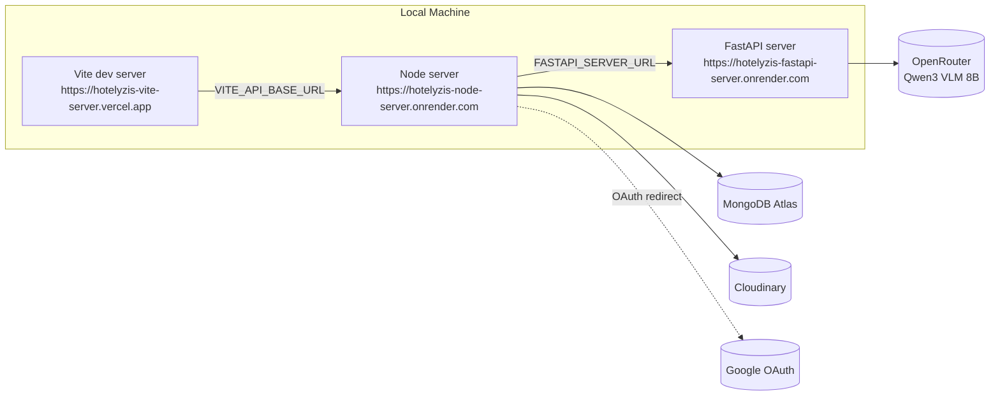

# Infrastructure

This document covers **where things run**, **what third-party services the platform depends on**, and **how to get the full stack running locally**. For _how_ each service is built internally, see [backend.md](./backend.md) and [frontend.md](./frontend.md).

## Hosting Plan

| Component      | Platform   |
| -------------- | ---------- |
| Client (Vite)  | **Vercel** |
| Node server    | **Render** |
| FastAPI server | **Render** |

## Topology (current — local development)



---

## Third-Party Services

| Service              | Used by        | Purpose                                                                                                                                                                                |
| -------------------- | -------------- | -------------------------------------------------------------------------------------------------------------------------------------------------------------------------------------- |
| **MongoDB Atlas**    | Node server    | Primary datastore (`User`, `Input`, `Result` collections) and session store (via `connect-mongo`) — see [data-modeling.md](./data-modeling.md)                                         |
| **Cloudinary**       | Node server    | Image hosting for review photos, uploaded from the `/get-review-analysis` flow — see [backend.md](./backend.md#cloudinary-integration-servicescloudinaryservicejs)                     |
| **Google OAuth 2.0** | Node server    | Social login, via `passport-google-oauth20` — see [backend.md](./backend.md#authentication-configpassportjs)                                                                           |
| **OpenRouter**       | FastAPI server | Hosted access to `qwen/qwen3-vl-8b-instruct` (Qwen3 VLM 8B), used for both aspect extraction and visual grounding — see [api-documentation.md](./api-documentation.md#model--provider) |

---

## Environment Variables

### Client (`client/.env`)

| Variable            | Local value                                         | Notes                                                                                      |
| ------------------- | --------------------------------------------------- | ------------------------------------------------------------------------------------------ |
| `VITE_API_BASE_URL` | `https://hotelyzis-node-server.onrender.com/api/v1` | Base URL the client uses to reach the Node server. Update to the Render URL in production. |

### Node server (`node server/.env`)

| Variable                 | Local value                                                              | Notes                                                                                                                                                       |
| ------------------------ | ------------------------------------------------------------------------ | ----------------------------------------------------------------------------------------------------------------------------------------------------------- |
| `PORT`                   | `3000`                                                                   |                                                                                                                                                             |
| `MONGO_DB_URL`           | _(secret)_                                                               | MongoDB Atlas connection string (combined with the DB name from `constants.js` — see [backend.md](./backend.md#database-connection-config--referenced-db)). |
| `MODE`                   | `development`                                                            | Toggles `secure` cookie flag and whether `globalErrorHandler` includes a `stack` trace.                                                                     |
| `CORS_ORIGIN`            | `https://hotelyzis-vite-server.vercel.app`                               | Must match the client's origin exactly (credentials mode requires an explicit origin, not `*`).                                                             |
| `SESSION_SECRET`         | _(secret)_                                                               | Signs the session cookie.                                                                                                                                   |
| `GOOGLE_CLIENT_ID`       | _(secret)_                                                               | Google OAuth app credentials.                                                                                                                               |
| `GOOGLE_CLIENT_SECRET`   | _(secret)_                                                               |                                                                                                                                                             |
| `GOOGLE_CALLBACK_URL`    | `https://hotelyzis-node-server.onrender.com/api/v1/auth/google/callback` | Must match the redirect URI registered in the Google Cloud Console OAuth client.                                                                            |
| `CLOUDINARY_CLOUD_NAME`  | _(secret)_                                                               |                                                                                                                                                             |
| `CLOUDINARY_API_KEY`     | _(secret)_                                                               |                                                                                                                                                             |
| `CLOUDINARY_API_SECRETE` | _(secret)_                                                               |
| `FASTAPI_SERVER_URL`     | `https://hotelyzis-fastapi-server.onrender.com/api/v1/reviews/analyse`   | Full URL to the FastAPI analysis endpoint, including path.                                                                                                  |
| `CLIENT_URL`             | `https://hotelyzis-vite-server.vercel.app`                               | Used for Google OAuth redirect targets after login success/failure (see `handleGoogleCallback` in [api-documentation.md](./api-documentation.md)).          |

### FastAPI server (`fastApi server/.env`)

| Variable             | Local value   | Notes                                             |
| -------------------- | ------------- | ------------------------------------------------- |
| `MODE`               | `development` |                                                   |
| `OPENROUTER_API_KEY` | _(secret)_    | Bearer token for OpenRouter chat completions API. |

---

## Local Development Setup

No Docker Compose currently — each service is run independently with its own dev command. Three terminals:

```bash
# 1. Client (Vite dev server) — from client/
npm run dev

# 2. Node server — from node server/
npm run start

# 3. FastAPI server — from fastApi server/
fastapi dev app/main.py
```

**Before running:**

1. Copy each `.env.sample` to `.env` in the three respective directories and fill in the secrets (MongoDB Atlas URI, Cloudinary credentials, Google OAuth credentials, OpenRouter API key, a `SESSION_SECRET` of your choice).
2. Ensure a MongoDB Atlas cluster exists and its connection string is reachable (whitelist your IP or allow `0.0.0.0/0` for local dev).
3. Register a Google OAuth 2.0 client with `https://hotelyzis-node-server.onrender.com/api/v1/auth/google/callback` as an authorized redirect URI.
4. Node server dependencies: `npm install` (from `node server/`). Client dependencies: `npm install` (from `client/`). FastAPI dependencies: `pip install -r requirements.txt` (ideally inside a virtualenv — a `.venv` folder is already `.gitignore`d in the repo).

No seed data / fixtures currently exist — the app starts with an empty database.

---
